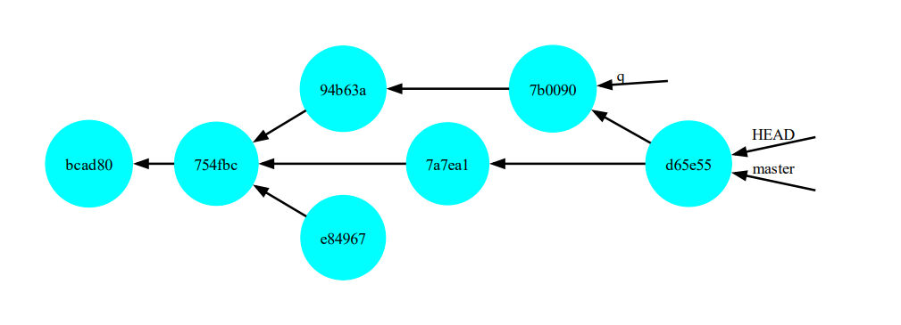

# Wit project.
## A project that allows version control, backup and tracking of projects(similar to GIT). 

wit is a version control system that tracks changes in any set of computer files, usually used for coordinating work among programmers who are collaboratively developing source code during software development.

## Features
Run from CMD by the following commend: `python "wit_path" <commend> <argument>`
#### Supports the following commands:
- init 
- add <path>
- commit <message>
- status
- checkout <commit\\branch>
- graph <--all>(optional)
- branch <commit\\branch>
- merge <commit\\branch>

## init
#### Initializing '.wit' folder in current working directory.
**The following folders will be created inside wit folder:**

 - **images** - which will contain all the 'saves' that will be made.

 - **staging_area** - which will contain all the files that the user specifically requested to be backed up.

 - **graphs** - which will contain a snapshot of the commits (will be created by calling the 'graph' commend).

**And two text files:**

 - **activated.txt** - which contains the currently active branch.

 - **references.txt** - which contains information about the HEAD, master and branches(will be created by calling the 'commit' commend).

## add
#### Adding the tree folders of the path to the 'staging_area'.
Receives a parameter - the name of a file or folder, and will add to the 'staging_area' folder the file, or all the files that are under the folder received as a parameter.
If the given parameter is '.' All folders under the current working directory will add into 'stage_area'.
If there is no '.wit' folder in any super folder, raise an error.

## commit
#### Commit the changes to images folder.
The command receives as a parameter a message that will describe the commit.
This command creates a "save point", to which we can restore the project when we want.
When we commit, we will create an "image" from the files we collected into staging_area.
The commend will generate a random name for the backup folder from the following 40 characters: "1234567890abcdef".
And you will create a text file that contains the details of the commit: parent, date and message.
The function will also change the references file that will point to the new data.
If there is no '.wit' folder in any super folder, raise an error.

## status
#### Prints the current state of your wit working directory and staging area.
**The function will print a message to the user that will contain the following details:**
| Headline | Description |
| --- | --- |
| Current commit: | The HEAD of commits. |
| Changes to be committed: | Files that we added since the last commit, and they will be added to the folder that will be created in images in the next commit command. |
| Changes not staged for commit: | Files that are currently in 'staging_area', but their contents in the "real folder" do not match their contents in the 'staging_area' folder. |
| Untracked files: | Files that do not have a matching file in staging_area. |

If there is no '.wit' folder in any super folder, raise an error.

## checkout
#### Updates files in the working tree to match the version in the id.
The command receives as a parameter an id - id of commit or name of branch.
The command will replace all the files that are under the "original folder" (the one that contains the .wit folder), with the files that are in the backup folder (the files that appear under the heading Untracked files: will not be changed).
In order not to lose information, the command will not run if there are files that appear in "status" under the heading Changes to be committed':', or under the heading 'Changes not staged for commit:'.
The function will also change the references file and the activated file that will point to the new data.
If there is no '.wit' folder in any super folder, raise an error.

## graph
#### Show commit graph.
The command will draw a graph (using the 'graphviz' module).
The construction of the graph will start from the HEAD. From this an arrow came out towards the commit id which is marked as its parent. From its parent came an arrow to the parent above it, and so on.
If the '--all' parameter was passed to the command, display all existing commits.
If there is no '.wit' folder in any super folder, raise an error.
##### For example:

## branch
#### Create a branch.
The command takes a name parameter.
This command applies a label with a NAME to the commit we are working on. We call this label a branch.
As long as the HEAD is on this branch, and this branch is in "activated state", the label will progress with us in every commit we make.
To activate the branch we will run the `checkout branch_name` command.
If there is no '.wit' folder in any super folder, raise an error.

## merge
#### Merge between two branches\commits.
The command takes an 'id or branch name' parameter.
This command will create a new commit, which will unite the files between the HEAD, and the id.
Files that have not been changed in both places will be copied as they are. 
Files that have been changed in relation to the original file only in one of the places, the changed file will be copied. 
Files have been changed in both places, the software will try to compare according to the metadata of the files or go line by line and try to merge them, if it fails it will raise an error.
If there is no '.wit' folder in any super folder, raise an error.

An exercise from Yam Mesica Python course.
